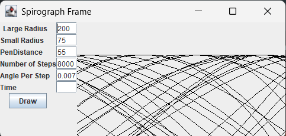

### Spirograph 

Created an image of a spirograph based on a given radius inner and 
outer and a pen point

### Screenshots

#### Links

- [Mockito](https://site.mockito.org/)
- [GridBagLayout](https://docs.oracle.com/javase/tutorial/uiswing/layout/gridbag.html)
- [Junit](https://junit.org/)